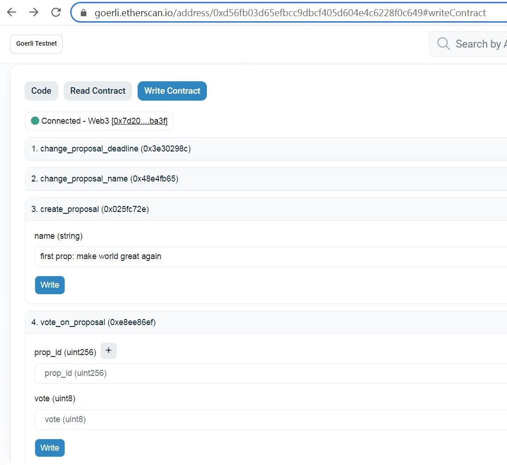
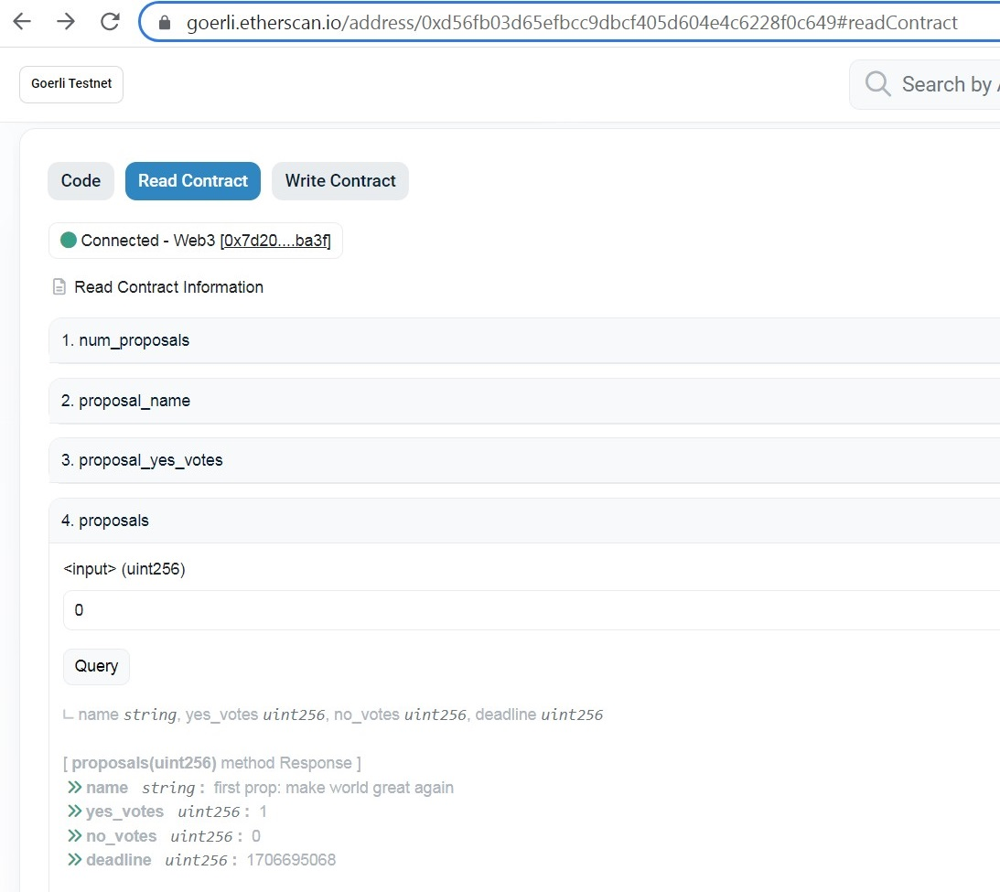

# dao_ethereum

## Info    
This is a simple DAO (decentralized autonomous organization) smart contract project with Truffle suite and Ethereum.  

## Usage   

Currently, deployed on testnet Goerli and can be used by everyone:     
https://goerli.etherscan.io/address/0xd56fb03d65efbcc9dbcf405d604e4c6228f0c649#writeContract   

To use this contract (e.g. create, vote on proposals etc..), simply install Metamask, create account and get free Eth from https://goerlifaucet.com/.  

### Create new proposal 


### Read proposal 



## Compile and Test    

Compile:  
```
truffle compile
```

Test:  
```
truffle test
Compiling your contracts...
===========================
> Compiling ./contracts/Dao.sol
> Compiling ./test/TestDao.sol
> Artifacts written to /var/folders/38/3l23x7_52t991w22sk9639h00000gn/T/test--13805-NpMs8g6q2uTo
> Compiled successfully using:
   - solc: 0.8.18+commit.87f61d96.Emscripten.clang


  TestDao
    ✔ test_create_proposal (187ms)
    ✔ test_change_proposal_name (674ms)


  2 passing (6s)
  ```
